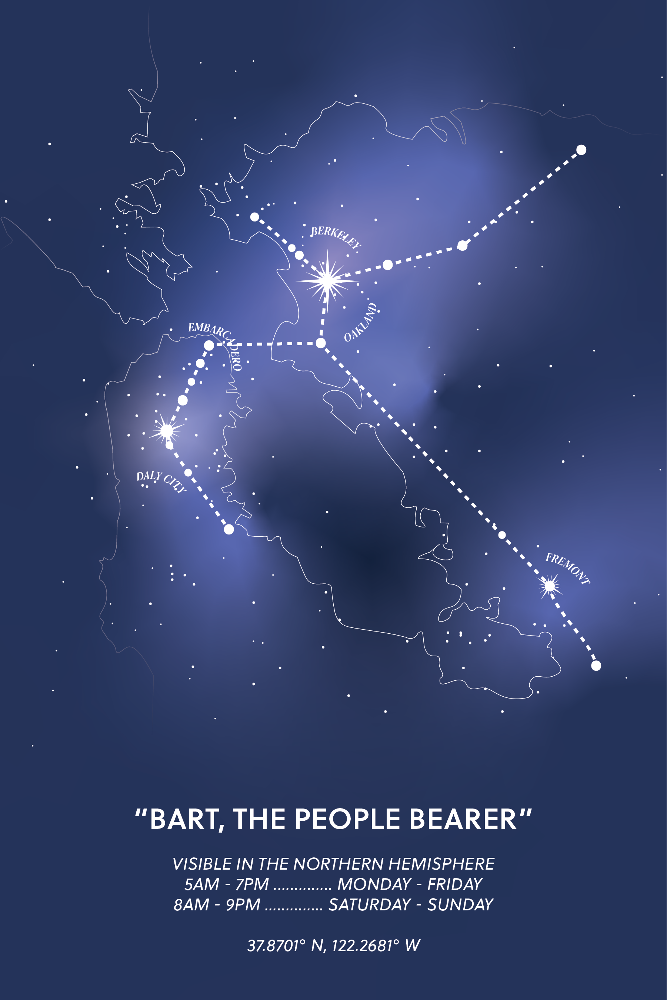

## EthiCAL Apparel Design Portfolio

EthiCAL Apparel is a student-run design organization for social good at Berkeley. I am an associate on the design team and participate in 2-3 product releases per semester where I create original apparel, stickers, and prints depicting everything from sustainability themes to life at Berkeley. 

EthiCAL donates ~60% of its profits to local organizations fighting for environmental justice, water conservation, and worker's rights, to name a few causes. Through my time in the club I've learned a lot about the design process including ideation, critique, and working within production constraints and deadlines. I've also gained insight on marketing and responsibly sourcing materials for apparel printing and shipping by working with our marketing and sales teams. Read more about EthiCAL [here!](https://www.ethicalapparel.org)

|Orion's BART|
|:---:|
||
|This design is EthiCAL's first print available on our online store. I was inspired by classic illustrations of constellations and star maps.|

 
 

|Reboot|
|:---:|
||
|This sticker inspired by my love of vintage technology, and a reflection of how said technology is virtually gone from the home and office but still present in landfills beyond our lifetimes.|

 
 

|Let's Picnic|
|:--:|
||
|This t-shirt was my first design for EthiCAL and was part of a product release supporting personal sustainability.|
