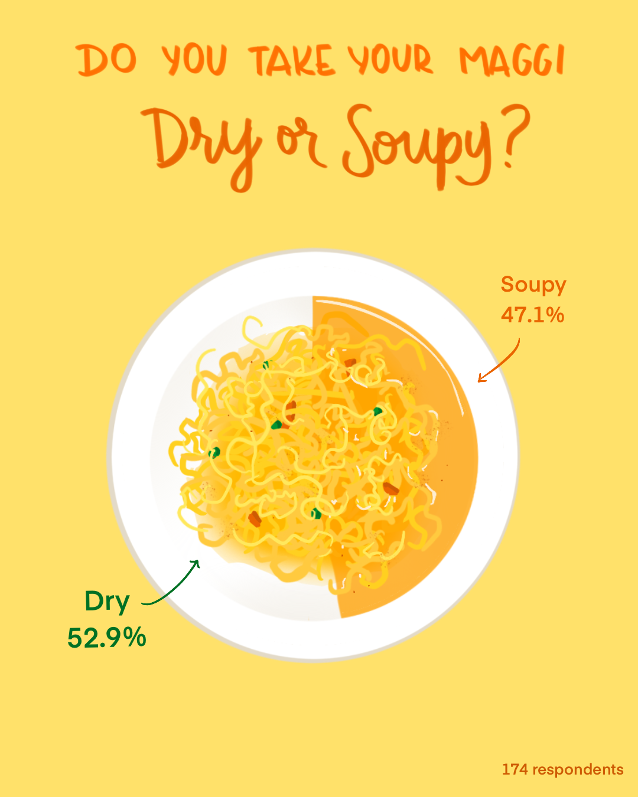
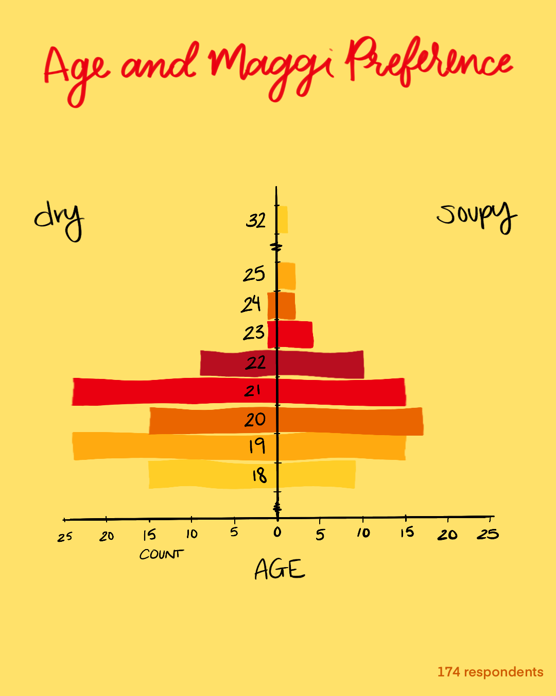
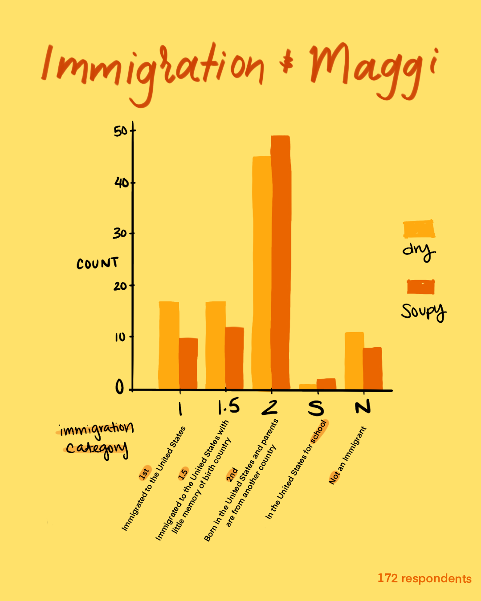

## The Maggi Project

Maggi is a popular instant noodle brand in South Asian countries and the diaspora. As a 1.5th generation Bengali-American immigrant from India, the bright yellow instant noodle package was -- and still is -- a pantry staple. I place Maggi in same culinary-emotional cupboard as Kraft Mac and Cheese. Looking into its history, I was surprised by its origin story.

Maggi is a Swiss brand dating back to the 1800s, currently owned by Nestle. Maggi's instant noodle package hit India in the 1980s, marketed to moms who were modern working women.

> In its first ads, the brand popularized the image of the “Maggi Mom”: she cared for her children as much as the more-traditional Indian mother, but, as a modern working woman, didn’t have the time to make time-consuming curries. Kids loved Maggi; moms loved making Maggi. It took only “2 Minutes” (a phrase used in India to mean, “like, pretty soon,” i.e., anything from now to twenty minutes from now).

\-- [How Maggi noodles became India's favourite comfort food](https://scroll.in/article/701437/How-Maggi-noodles-became-India's-favourite-comfort-food),

The "2-minute noodles" were a hit and have remained popular in South Asia ever since (barring recent complications with food safety in India).

Though a region as diverse as South Asia (+ the diaspora) shares the same love for the instant noodles, Maggi's preparation varies from city to city and family to family. 

Inspired by an instagram post, I sought to answer a seemingly simple question:
> Can you tell a lot about a person by if they like their Maggi dry or soupy?

 I made a Google Forms survey asking mostly college students how they liked their Maggi, and a handful of other random questions such as:
- Where is your hometown?
- Where is your city of origin?
- Are you an immigrant?

### The Process
I cleaned and analyzed the data with Python, using `pandas`. I used `seaborn` and `matplotlib` for early data visualizations and `folium` and `opencages` for geolocation and maps. 

I sought to represent the data with playful and understandable visuals. I take inspiration from data journalist [Mona Chalabi](https://monachalabi.com), who emphasizes showing uncertainty in data with hand-drawn elements. I drew the visuals on my iPad with Procreate.

### Data Visuals

Suprisingly, people prefer their Maggi dry. 

### Things I learned

#### Project design

> **Considering cultural memory**

Looking back on what I learned about Maggi's history, the noodles really became popular in India when my parents' generation were growing up. By the 90's, hundreds of thousands of Indians were immigrating, with the overwhelming majority going to the UK and USA ([source](https://www.migrationpolicy.org/article/emigration-immigration-and-diaspora-relations-india#2)). While I looked at immigration generation in my survey, most of the respondents were in their early 20's. I'd really like to see how older South Asians feel about Maggi, and would love to include people in Europe as well. 

#### Questionnaire design
> **Keep text data categorical and discrete whenever possible**

When asking questions about immigration and geographic origin, I wanted to be as inclusive as possible and allow respondents to explain their personal histories with an open text box. However, my assumptions on the data input being mostly uniform challenged me when it was time for analysis. 

Specifically, I asked about geographic origin in terms of "hometown" and "city of origin". But people may have multiple cities of origin, (for example, their parents are from two different cities, and therefore they identify with two different regional cultures). While I tried to enforce input format with a suggestion of `City, State, Country`, this got complicated as India, and several other countries have changed with each generation of immigrants. Therefore I encountered differences between reported names of states and cities and their modern-day geopolitical names. 

In the future, `States` might be changed to `State/Province/Territory` on a form to be more inclusive, and I'd like to separate the input of `City`, `State`, and `Country`. Perhaps including auto-population for locations might be useful, as well as the ability to add multiple origin locations.

*\*visuals about geographic origin are being refactored for web interaction*

> **Sometimes, less data is better**

A slightly amusing example of this is with color and area of study/major. I kept both as text instead of multiple-choice. I believe in hindsight that coarse-grain, categorical data would have been much easier to analyze with this sample size. For example, responses `"cornflower blue"` and `"navy"` would have functionally been `"blue"` on my end for analysis. Or I would have condensed `"Computer Science"` and `"Applied Math"` into a `"STEM"` category. In the end I decided not to analyze color because I couldn't find an efficient way to map responses into coarse categories. In the future, these are questions I would make into multiple choice form questions. 

